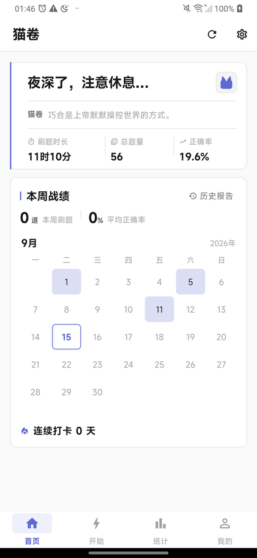
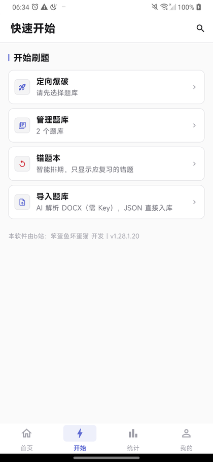
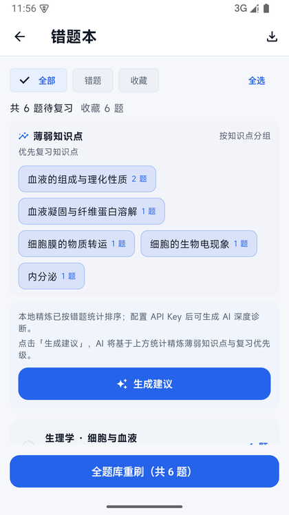
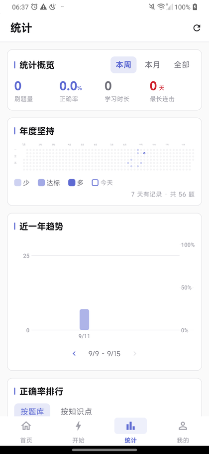

<div align="center">

# 猫卷

**本地优先的 AI 备考刷题工具**

题库自己建 · 数据自己管 · AI 讲透 · 算法记住

[](#下载安装)
[](../../releases)
[](LICENSE)
[](https://github.com/laow07573-web/daimao-quiz-master/actions/workflows/ci.yml)

</div>

---

你是否也受够了市面上的付费刷题软件？会员制、按科目收费、题库封闭、数据锁在云端账号里……

**猫卷**换了个思路：把学习资产的所有权还给备考的人。

- **题库自己建** —— 丢一份 Word 文档进去，自动变成可刷的题库
- **数据自己管** —— 题库、错题、批注、复习进度全部存在你自己的设备里，离线可用、随时备份迁移
- **AI 讲透** —— 逐题按「题眼破题法」讲解、支持追问，用你自己的 API Key 直连，数据不经过第三方服务器
- **算法记住** —— 内置 FSRS-5 间隔重复算法，按遗忘曲线安排每道错题的下一次复习

**无账号 · 无广告 · 无会员 · 完全免费。**

---

## 界面预览

<div align="center">
  
  
  
  
</div>

<p align="center"><sub>首页 · 开始 · 错题本 · 统计（真机实拍，非示意图）</sub></p>

---

## 功能特性

### 📥 智能建库

| 功能 | 说明 |
|------|------|
| DOCX 导入 | 长文档按题目边界智能切块，多路并发解析，不阻塞界面 |
| JSON 导入 | 结构化题库直接入库，无需 AI 解析 |
| 可视化校对 | 入库前逐题预览、编辑、删除，附带 AI 打的知识点标签 |
| 一键导出 | 题库导出为标准 JSON，可分享给同学直接导入 |
| 多库管理 | 多题库并存，可单独或组合刷题；重名自动编号 |

### 🤖 AI 讲解

| 功能 | 说明 |
|------|------|
| 题眼破题法 | 四步拆解：抓题眼 → 理逻辑 → 指坑点 → 划重点 |
| 篇幅三档 | 简洁（≤150 字）/ 标准（≤300 字）/ 详细，设置里随时切换 |
| 关键词高亮 | 答案绿、题眼蓝、避坑红；AI 标出关键依据与易错否定词 |
| AI 追问 | 独立全屏对话页，像聊天一样追问，问答按题保存 |
| 接口兼容 | 兼容任意 OpenAI 兼容接口（官方 API 与第三方订阅均可） |
| 连接测试 | 设置页可一键测试 API 是否可用，并拉取可用模型列表 |

### 📚 刷题

| 功能 | 说明 |
|------|------|
| 三种模式 | 正常刷题（答完即判）/ 练习（限时或不限时 + 答题卡）/ 背题（高亮答案不记统计） |
| 七种题型 | 单选、多选、判断、填空、名解、简答、问答，各有对应判分逻辑 |
| 断点续刷 | 中途退出进度保留，下次从首页继续 |
| 滑动切题 | 左右滑动切换上一题 / 下一题 |
| 手动改判 | 主观题可手动纠正判定结果，不新增记录、不污染统计 |
| 答题音效 | 对错提示音，可在设置中开关 |

### 📝 错题与复习

| 功能 | 说明 |
|------|------|
| FSRS-5 排期 | 按遗忘曲线计算每道错题的下次复习时间，只显示到期的题 |
| 行为自动评分 | 答错 / 快答对 / 慢答对自动映射为不同记忆难度，无需手动打分 |
| 薄弱诊断 | 按题库、按知识点统计正确率，定位薄弱环节（本地统计，无需 Key；AI 深度诊断需 Key） |
| 知识点标签云 | 按知识点聚合错误，可一键专项复习 |

### ✍️ 手写批注

| 功能 | 说明 |
|------|------|
| 直接手写 | 在题目上圈关键词、划重点、写推导 |
| 三种笔型 | 细笔 / 普通笔 / 荧光笔，支持压感调宽 |
| 按题保存 | 笔迹按题目持久化，切题、重启、换设备都不丢 |
| 跨设备隔离 | 批注按设备各存一份，多端同步时互不覆盖 |

### 📊 数据可视化

| 功能 | 说明 |
|------|------|
| 年度坚持 | GitHub 贡献图样式的年度热力图，一整年 53 周一眼看全 |
| 近一年趋势 | 双 Y 轴对照（题量柱状 + 平滑正确率曲线），支持分页与单日明细 |
| 正确率排行 | 按题库 / 按知识点两个维度 |
| 错题统计 | 总数、待复习、按题库分布、最早到期时间 |
| 历史会话 | 每轮练习可回看，支持改判修正 |

### 🔄 多端与同步

| 功能 | 说明 |
|------|------|
| 局域网同步 | 同一 Wi-Fi 下自动发现设备，双向交换题库与刷题进度，不经过云端 |
| 三端自适应 | 手机底部导航，宽屏（平板 / 桌面）自动切换为左侧导航 + 左右并排布局 |
| 深色模式 | 三套主题各含深色变体，可跟随系统或手动切换 |
| 每日提醒 | 本地时区排程 + 前台服务保活，到点提醒你刷题 |
| 寒暑假模式 | 假期暂停提醒与复习排期，不中断连续打卡 |

---

## 下载安装

前往 **[Releases](https://github.com/laow07573-web/daimao-quiz-master/releases/latest)** 下载最新版本。

| 平台 | 文件 | 说明 |
|------|------|------|
| Android | `MaoJuan-v<版本>-android-arm64.apk` | 2017 年后绝大多数手机，约 20 MB |
| Android | `MaoJuan-v<版本>-android-universal.apk` | 含全部 CPU 架构，不确定机型时用，约 35 MB |
| Windows | `MaoJuan-v<版本>-windows-setup.exe` | Windows 10/11 64 位安装包 |
| Windows | `MaoJuan-v<版本>-windows-portable.zip` | 绿色免安装版，解压即用 |

> 文件名中的 `<版本>` 随版本变化（例如 `MaoJuan-v1.28.1-android-arm64.apk`），
> 所以这里不写死版本号——请以 Releases 页面上的实际文件名为准。
> 每个 Release 都附 `SHA256SUMS.txt` 校验值，下载后可自行核对完整性
> （校验方法见下方[安装与校验](#安装与校验)）。

> **基础刷题功能完全离线可用**，无需联网、无需配置任何东西。
> 需要 API Key 的只有三类：**DOCX 题库导入**（题目靠 AI 解析）、AI 逐题讲解与追问、
> 错题本的「生成建议」（AI 深度诊断）。
> **JSON 题库文件与内置示例题库都不需要 Key、也不用联网。**

### 关于 API Key

猫卷采用 **BYOK（Bring Your Own Key）** 模式：AI 请求由你的 Key 直连模型服务商，
项目方不接触你的任何数据，也没有任何 API 成本转嫁。

1. 到模型服务商申请一个 API Key（默认适配 DeepSeek，也兼容通义、智谱、Kimi、OpenAI、OpenRouter 等）
2. 打开猫卷 → 设置 → 填入 Key 与接口地址（预设列表可一键填入）
3. 点「测试连接」确认可用，再点「选择模型」拉取可用模型

---

## 安装与校验

### 为什么系统会提示「不安全」

安装包目前**没有购买代码签名证书**，所以两个平台都会在首次安装时给出提示。
这是「未签名」而非「有问题」，按下面的步骤正常安装即可：

| 平台 | 出现的提示 | 处理方式 |
|---|---|---|
| Windows | SmartScreen 蓝屏「Windows 已保护你的电脑」 | 点「**更多信息**」→「**仍要运行**」 |
| Android | 「未知来源」/「禁止安装未知应用」 | 在系统设置里为当前文件管理器开启「允许安装未知应用」，或在安装提示中直接选择「允许」 |

> 如果不放心，请继续看下面的校验步骤——**核对过 SHA-256 再安装**是最稳妥的做法。
> 另外请只从本仓库 Releases 或[官方推广页](https://laow07573-web.github.io/daimao-quiz-master/)下载，
> 不要使用第三方转载的安装包。

### 校验 SHA-256

每个 Release 都附有 `SHA256SUMS.txt`，里面是四个产物的完整校验值。

**Windows（PowerShell）**

```powershell
# 把文件名换成你实际下载的那个
Get-FileHash .\MaoJuan-v1.28.1-windows-setup.exe -Algorithm SHA256
```

把输出的 `Hash` 与 `SHA256SUMS.txt` 里对应行对比，一致即说明文件完整、未被篡改。

**Android**：用任意哈希校验工具（如「哈希校验」类 App）计算 APK 的 SHA-256，
与 `SHA256SUMS.txt` 中 `-android-arm64.apk` 那一行对比。

---

## 快速上手

1. 安装并打开猫卷
2. 首页 →「导入题库」→ 选择文件：
   - **`.json` 题库** —— 直接入库，**无需 Key**
   - **`.docx` 文档** —— 用 AI 解析题目，**需要先在设置里配好 Key**（没配 Key 时点导入会提示去配置）
   - 也可以直接点「一键导入示例题库」离线体验（无需文件、无需 Key）
3. 首页勾选题库 →「定向爆破」→ 选择题量与模式 → 开始刷题
4. 答完看解析：题目自带解析**无需 Key** 即可查看；配了 Key 才有 AI 逐题讲解，不懂可点「向 AI 追问」
5. 答错的题自动进入错题本，FSRS 会按遗忘曲线给你安排复习

更完整的功能演示见 `promo/index.html`（单文件静态页，双击即可打开）。

---

## 数据与隐私

| 项 | 说明 |
|----|------|
| 数据存储 | 全部数据存在设备本地 SQLite 数据库，离线可用，卸载即彻底删除 |
| 备份迁移 | 一键导出数据库，换设备导入即可恢复题库、记录与批注。**默认不含 API Key**（换机后重填一次即可）；如需连 Key 一起迁移，可设置备份口令，整个备份文件会被加密 |
| API Key 加密 | AES-256-GCM 加密，Android 上优先存入系统 Keystore |
| 无账号体系 | 不采集任何个人信息，无登录、无云端上传 |
| 防篡改 | 签名校验锁定，被二次打包会拒绝启动 |
| 发布构建 | 开启代码混淆，反编译不可读 |

---

## 工程质量

- **311 项自动化测试**，覆盖判题、复习算法、数据层、导入解析、同步、布局自适应等
  （每次 push 由 [GitHub Actions](https://github.com/laow07573-web/daimao-quiz-master/actions) 自动执行，见上方 CI 徽章）
- 数据库 schema v11，外键级联、索引优化、事务一致性
- 每次发版依次执行：静态分析（0 error / 0 warning）→ 全量测试 → 混淆构建 → **组件 / 权限 / 文案 / 资源四维基线对照校验** → 签名校验

发布历程：2026 年 6 月 15 日动工（初版「呆猫刷题宝」）→ 8 月 42 项修复 + AES 加密 →
8 月起重建为「猫卷」，完成全新 UI、手写批注、局域网同步、三端适配与 AI 能力扩展。

---

## 技术栈

Flutter 3.24 · Dart 3.5 · SQLite (sqflite) · Provider · FSRS-5 · AES-256-GCM · UDP 局域网发现

---

## 从源码构建

```bash
flutter pub get
flutter analyze --no-fatal-infos   # 应输出 0 error / 0 warning（info 级提示不计）
flutter test                    # 全量测试（当前 311 项）
flutter build apk --release --obfuscate --split-debug-info=build/symbols
flutter build windows --release
```

> 版本号的唯一来源是 `pubspec.yaml` 的 `version:` 字段（形如 `1.28.1+20`）。
> 发布构建会通过 `--dart-define=APP_VERSION=v<版本名>.<构建号>` 把它注入应用
> 内展示，不需要在任何 Dart 文件里手工改版本号。
> `test/version_single_source_test.dart` 会校验两者一致，防止版本号漂移。
>
> 本地开发直接 `flutter run` 时应用内显示的是 `kAppVersion` 的默认值（不带
> `--dart-define`），与正式包的展示一致即可，无需特殊处理。

> ⚠️ **签名文件与密钥永不入库**：`android/key.properties`、`**/*.jks`、`**/*.keystore`
> 均已在 `.gitignore` 中排除。请自行生成签名并妥善离线备份。

---

## 常见问题

**Q：一定要配 API Key 才能用吗？**
不用。刷题、判分、错题本、复习排期、手写批注、数据统计全部离线可用；
**JSON 题库与内置示例题库也不需要 Key、不用联网**。

需要 Key 的只有三类：

1. **DOCX 题库导入** —— 题目靠 AI 解析，没有 Key 无法导入（这是最容易踩的一点，导入页会直接提示去配置）；
2. **AI 逐题讲解与「向 AI 追问」**；
3. **错题本的「生成建议」**（AI 深度诊断）。

本地错题统计、知识点标签、正确率排行都不需要 Key。

**Q：我的数据会被上传吗？**
不会。所有数据存在本机数据库；AI 请求由你的 Key 直接发往模型服务商，不经过本项目。

**Q：AI 回答太长/太短怎么办？**
设置 →「AI 回答风格」→ 回答详细程度可选简洁 / 标准 / 详细，并可开关关键词高亮。

**Q：怎么备份到新手机？**
设置 → 导出数据库备份 → 在新机导入即可恢复题库、记录与批注。

默认导出的备份**不含 API Key**（避免"把备份发给别人 = 把 Key 也给了别人"），
换机后重新填一次 Key 即可。如果你希望连 Key 一起迁移，导出时选择「含 API Key」，
并设置一个备份口令——整个备份文件会用该口令加密（AES-256-GCM），
导入时需要输入同一口令。**口令丢失则备份无法恢复**，请自行记牢。

**Q：支持哪些题型？**
单选、多选、判断、填空、名词解释、简答、问答，共七种。

---

## Roadmap

| 方向 | 状态 | 说明 |
|---|---|---|
| iOS 版本 | 评估中 | 代码已具备大部分平台判断，缺 Xcode 构建链与 iOS 侧适配（数据库路径、提醒、通知权限） |
| Web 体验版 | 计划中 | 无需安装即可试用核心刷题流程，降低第一次尝试的门槛 |
| 题库分享 | 计划中 | 仅限**用户自制题库**的分享，规避第三方教辅版权风险 |
| 代码签名证书 | 评估中 | 消除 Windows SmartScreen 与 Android「未知来源」提示 |

有想优先做的方向，欢迎开 Issue 讨论——尤其欢迎来自真实备考场景的需求。

---

## 参与贡献

- 发现 Bug 或有建议：提 [Issue](https://github.com/laow07573-web/daimao-quiz-master/issues)
- 想改代码：先看 [CONTRIBUTING.md](CONTRIBUTING.md)，从 `main` 开分支即可
- 安全问题：请勿公开提交，见 [SECURITY.md](SECURITY.md)

---

## Star

如果猫卷帮你省下了买题库会员的钱、或者让你少抄了一本错题——
**给个 Star 就是最实在的支持**。它能让更多正在备考的同学搜到这个项目。

---

## 致谢

- 作者：B 站 **笨蛋鱼坏蛋猫**
- 项目在开发过程中使用了 AI 编程工具辅助
- 感谢所有提供反馈与建议的早期用户

## 许可

[GNU AGPL-3.0](LICENSE) —— 自由使用 · 修改 · 分发，衍生作品须同样开源

- **自由使用** —— 可自由使用、修改、分发本项目，包括商业用途
- **相同方式共享** —— 修改后的衍生作品必须以同样的 AGPL-3.0 开源
- **网络服务须开源** —— 若把修改版作为网络服务提供，须向使用者提供完整源码
- **无担保** —— 按「现状」提供，不附带任何明示或暗示的担保

Copyright (c) 2026 笨蛋鱼坏蛋猫

> 完整协议文本见 [LICENSE](LICENSE)。选择 AGPL-3.0 而非 MIT 这类宽松协议，
> 是为了确保猫卷与它的任何衍生版本**始终对使用者保持开源**——
> 任何人都可以拿去用、拿去改，但不能改完就闭源。
